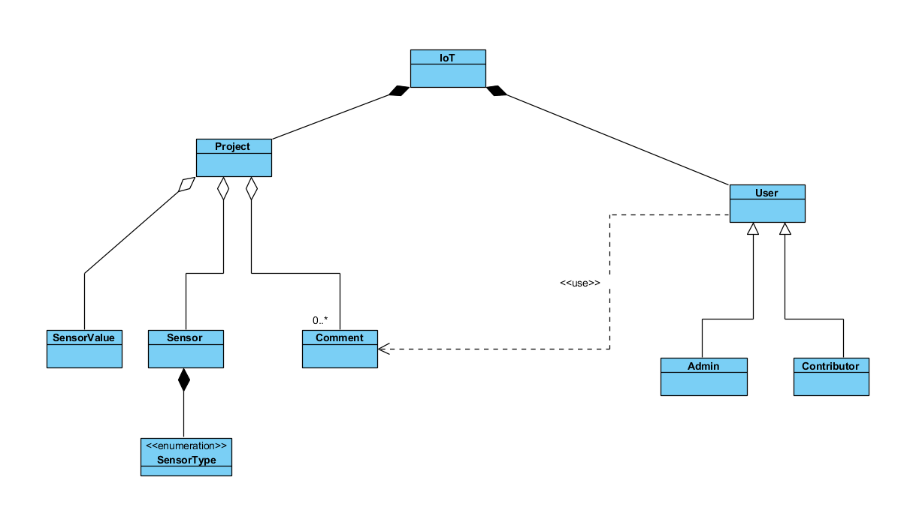

# Plataforma IoT de la E.T.S.I. Sistemas Informáticos

[](https://forthebadge.com)    
[](https://forthebadge.com)  
[](https://forthebadge.com)


Implementación de un laboratorio web para la experimentación con dispositivos IoT basado en la colaboración y compartición de conocimiento

## Tecnologías usadas
`Java` `Maven` `Spring-Boot` `Angular` `JPA` `SQL` `GitHub` `Sonarcloud` `Apache Tomcat`

Proyecto realizado por Miguel García Serrano bajo la supervision de Bernardo Tabuenca Archilla en la Escuela Técnica Superior de Ingeniería de Sistemas Informáticos

## :octocat: Repositorios
* [Front-end-angular](https://github.com/miguelgarse/iot-angular)
* [Back-end-spring](https://github.com/miguelgarse/iot-spring)

## :gear: Instalación del proyecto
1. Clonar repositorios, **mediante consola**:
* iot-angular
```sh
> cd <folder path>
> git clone https://github.com/miguelgarse/iot-angular
> cd iot-angular
iot-angular> npm install
```

* iot-spring
        
```sh
> cd <folder path>
> git clone https://github.com/miguelgarse/iot-spring
```

2. Importar el proyecto `iot-angular` en tu IDE preferido.
3. Importar el proyecto `iot-spring` en tu IDE preferido.
5. Ejecución
   * Ejecución de test: se utiliza H2 embebido
   * Ejecución en local:
      1. BBDD. Se debe tener arrancado el motor de Postgresql: `spring.datasource.url=jdbc:postgresql://localhost:5432/backend`
      2. Spring. Ejecutar mediante linea de comando en ambos proyectos: `> mvn clean spring-boot:run`  
      4. Angular. Ejecutar mediante linea de comand: `> ng serve`
	  

# :book: Documentación del proyecto

El objetivo de este proyecto es implementar un laboratorio web para la experimentación con dispositivos IoT basado en la colaboración y compartición de conocimiento, todo ello desarrollado con tecnologías de libre acceso y distribución, siguiendo así el modelo Open Source, compartiendo, además, todo el código de este proyecto en la plataforma GitHub para que cualquiera pueda colaborar y mejorar la aplicación. 
En consonancia con los Objetivos de Desarrollo Sostenible (ODS) impulsados por la Organización de las Naciones Unidas, este proyecto está estrechamente relacionado con el ODS de Educación de Calidad, ya que pretende mejorar el acceso a los recursos de las instituciones de enseñanza. A parte de permitir a estudiantes con pocos recursos acceder a grupos de trabajo, también es una salida para todos aquellos que no pueden asistir a clases por la nueva situación provocada por el Covid-19.
Partiendo de proyectos y movimientos que ya existen en la actualidad como Fab-lab, Maker-Lab o DIY, cuya idea principal es proporcionar un espacio de trabajo físico (un laboratorio) donde se pueda aprender, colaborar, crear, descubrir y sobretodo compartir, esta plataforma web permite a los usuarios crear espacios de trabajo donde reportar mediciones tomadas con sensores que midan valores de humedad, presión atmosférica, temperatura, luminosidad, niveles de CO2, etc., para posteriormente publicar y compartir esos datos, para que otros usuarios puedan abastecerse de estas mediciones para sus propios intereses. De esta forma, creamos un entorno colaborativo o maker community, donde todos generan y consumen datos para sus propias motivaciones.



